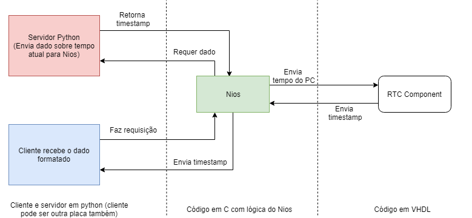
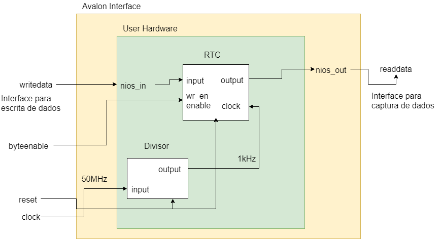
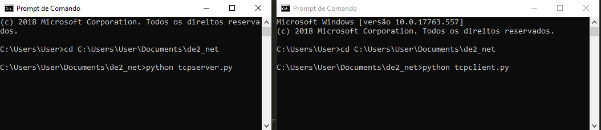
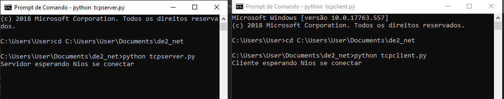
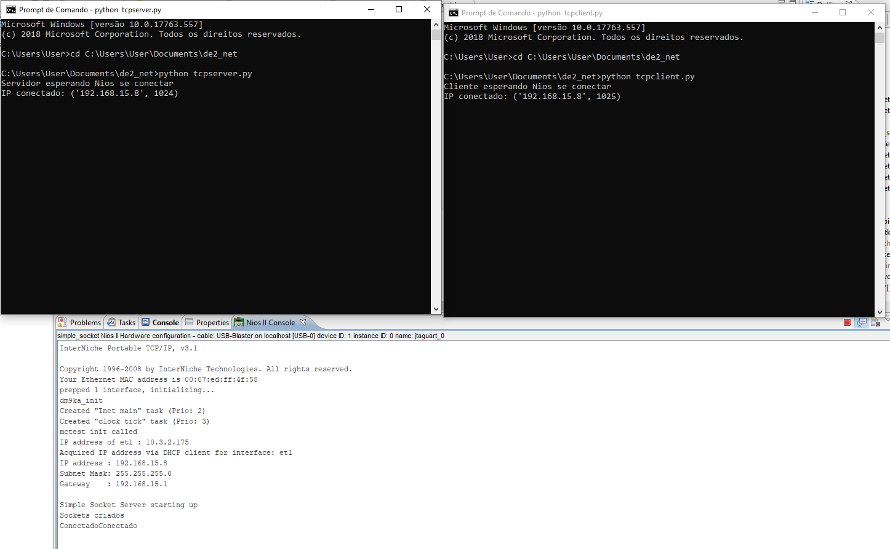

# de2_net

Projeto de Lógica Reconfigurável de criação de conexão TCP/IP através de Sockets, dos alunos André Luiz Rodrigues dos Santos (RA1500759-UTFPR) e Luís Henrique Beltrão Santana (RA906867-UTFPR)

-  Objetivos do projeto:
    - Criar um projeto com comunicação entre cliente-servidor usando protocolo TCP/IP, integrando a FPGA, o processador Nios e componentes VHDL
    
    
- Estrutura do projeto consiste em: 
    - Componente do Nios criado pelo Qsys e controlado por um código em C, modificado a partir do tutorial fornecido na página 
    - A partir do tutorial fornecido pelo professor, foi criado um projeto qif dentro da pasta de2_net
    - Códigos em python para criar um servidores usando protocolo TCP/IP e se comunicar via ethernet com o Nios usando sockets
      -- Primeiro o servidor se comunica com o Nios e envia o timestamp atual - código em tcpserver.py
      -- Segundo cliente, que pode ser tanto um cliente python como outra placa, requisita atráves de um socket envia uma mensagem e recebe continuamente o timestamp (código em tcpserver.py)
    - O user hardware contém um contador RTC escrito em VHD, e também um divisor de clock para funcionar sempre em 1kHz. Encapsulando o user hardware foi criado um componente "avalon interface" para facilitar a criação de um componente customizável pelo Qsys, seguindo .
    - Projeto do RTC isolado pode ser encontrado na pasta "rtc"
    - O diagrama simplificado do componente é o seguinte:
      
    - Os .vhd do projeto podem ser vistos na pasta de2_net>vhdl
  
- Abrindo o projeto 

    - No Quartus, Será necessário gerar novamente os componentes do Qsys, adicionar o componente e os arquivos gerados como de costume
    - Compilar o projeto, ligar o cabo ethernet na placa em um ponto de rede e rodar o projeto na placa pelo programmer 
    - Abrir o Eclipse, ir em File> Switch Workplace e procurar escolher a pasta "software" dentro do projeto "de2_net"
    - Dar um "clean" no projeto simple_socket e no respectivo bsp
    - No arquivo C "iniche_init" alterar o IP nessa linha
       res = inet_pton(AF_INET, "192.168.15.2", &sa.sin_addr); //ALTERAR O IP DO SERVIDOR AQUI
    - Após descobrir o IP correto da máquina que está abrindo o projeto, alterar os arquivos "tcpserver.py", "tctclient.py" que estão na pasta raiz do projeto
    - Dar um "build" no projeto através da instrução "Build All" disponível na aba "Project" 
    - É aconselhável na primeira compilação ir em "Run Configurations", e em "Project" selecionar "Enable browse ...ELF File" escolher manualmente o ELF file do respectivo projeto, cuidadndo para pegar o ELF da pasta correto
     - Usando o CMD e tendo o python instalado, rode os servidores
      
      
      
    - Em seguida rode o projeto do Eclipse. O resultado esperado deve ser algo parecido com isso (prints de uma versão inicial do sistema)
      
  
 - Testbenchs
     - O testbench do funcionamento do componente RTC produziu a seguinte resposta:
     
     --É esperado que esse componente, estando habilitado e após receber um input, forneça timestamps crescentes, numa frequeência de 1kHz
     - O testbench da avalon também produziu o resultado esperado, lembrando que o readdata vai ser atualizado a cada N ciclos de clock, onde N é o número que estipulamos no divisor de clock. No testbench diminuimos de 50000 para 5 pra ser possível visualizar o funcionamento 
       

- Criação do componente do Qsys
A criação do componente Qsys seguiu [esse tutorial]  (https://github.com/dreewr/de2_net/blob/master/making_qsys_components%20(7).pdf) e também o projeto do Lucca como exemplo. Para a criação foram usados os vhdl avalon_interface(top-level), user_hardware, divisor e o rtc. Imagens das janelas de criação do componente podem ser visualizadas [aqui](https://github.com/dreewr/de2_net/blob/master/images/mapeamento%20qsys.PNG), [aqui](https://github.com/dreewr/de2_net/blob/master/images/cria%C3%A7%C3%A3o_componente.PNG) e [aqui](https://github.com/dreewr/de2_net/blob/master/images/componente%20qsys.PNG)

- Criação de um novo projeto
    - No Eclipse, crie um novo projeto + BSP from template
    - [Copie e sobrecreva esses arquivos](https://github.com/dreewr/de2_net/blob/master/images/17-07/arquivos%20copiados.PNG) dentro da pasta do projeto a partir do exemplo do Jimmy e Giovanna
    - "Project > Clean..." para automaticamente limpar
    - Ajuste o iniche para que use as constantes relativas ao system.h gerado pelo BSP
    
- Status atual do projeto (Update em 19/07)
    - O projeto completo está na pasta de2_net, com o programa do Nios na pasta [demo](https://github.com/dreewr/de2_net/tree/master/de2_net/software/demo)
    - Conseguimos criar um projeto com um componente NiosII capaz de se comunicar usando ethernet, integrado a um userHardware. Conseguimos ler e escrever nos bits desse userHardware usando as funções, mas tivemos que fazer a lógica da atualização do timestamp diretamente no C (escreve e lê no userHardware, mas não automaticamente).
    
   Na imagem, está um exemplo simples de como fazer uma troca de dados com o userHardware
 
     
    
    E os dados gerados pelo BSP no system.h
    
     
   
   - A parte de comunicação entre os sockets está funcionando, com os dois sockets trocando informações com o Nios como pode ser visto [aqui]()
    - Os componentes em vhdl estão testados (como mostrado na seção do testbench), 
    - A última versão estável do projeto está realizando a comunicação entre dois sockets, um cliente (mas que pode ser ampliado para vários clientes) e um servidor que fornece dados. O funcionamento é o seguinte: as conexões entre os sockets são feitas, o Nios requisita a informação pro servidor que retorna o timestamp atual. Em seguida o Nios processa esse dado lendo e escrevendo do userHardware, e usando um delay para incrementar o timestamp enviado 
        --[Demonstração do funcionamento da comunicação + userHardware](https://youtu.be/9SA49bZ5x3M)
        --[Print da comunicação entre Nios + userHardware, cliente e servidor] (https://github.com/dreewr/de2_net/blob/master/images/18-07/func_final.PNG)

- Referências e tutoriais úteis 
    - Nios II Developer Handbook https://github.com/dreewr/de2_net/blob/master/niosII%20-%20developer%20handbook.pdf Capítulo 7
    - Criando userHardware com o Qsys  https://github.com/dreewr/de2_net/blob/master/making_qsys_components%20(7).pdf
    - Projeto exemplo Mateus e Natan https://drive.google.com/drive/folders/1dg1V-4HZBoP_-wds2wTdr0P7JWgq_3xJ
   
 - Problemas encontrados e workarounds (quando possível):  
 No percurso de desenvolvimento, apareceram inúmeros erros, bugs e problemas intratáveis que impediram a finalização do projeto como desejado
    - Tempo de compilação do projeto bastante alto, considerando os vários passos necessários para os testes, acabou limitando a quantidade de abordagens e tentativas a serem usadas para solucionar os problemas. Cada projeto com um componente Nios demorava cerca de 8 minutos para compilar, além dos loadings para build e run no Eclipse que também consumiam bastante tempo. Considerando que cada nova tentativa requeria que todo o processo fosse refeito, cada "chute" tomava quase meia hora.
    - Problemas de geração e download do ELF file constantes ao tentar rodar os projetos no Eclipse. A solução que funcionou em alguns casos era dar um "reload" no arquivo o selecionando manualmente na janela do "Run Configurations".
    - [Erro](https://github.com/dreewr/de2_net/blob/master/images/erro%20deletar%20elf.PNG) ao executar "Clean" e "Build" em que o .ELF era deletado e não era possível gerá-lo novamente. Esse erro impossibilitava a continuidade do projeto, e o único contorno era abrir o projeto original do tutorial e modificá-lo novamente. Percebemos que as soluções para alguns problemas às vezes causavam outros ainda mais intratáveis e sem uma solução viável para o escopo do projeto.
    - [Erro  na compilação](https://github.com/dreewr/de2_net/blob/master/images/erro_qsys.PNG) após inserção de componente customizado e "generate" do Qsys - solucionado após limitar os bits dos componentes vhdl para 32, como o output do RTC, e usar o .qip em vez de adicionar o .v e os arquivos da pasta submodules diretamente.
    - [Problema de "DHCP" ao rodar o projeto no Eclipse](https://github.com/dreewr/de2_net/blob/master/images/17-07/dhcp.PNG) - Checar se o cabo Ethernet está ligado. Também pode ser algum problema na rede, principalmente na faculdade pode ocorrer algum problema nesse sentigo
    - Ao tentar abrir o código fornecido pelo Lucca, mesmo após diversas tentativas (usando o método do tutorial) o projeto não rodava no Nios (https://github.com/dreewr/de2_net/blob/master/images/Erros%20bizarros%20lucca.PNG). Nesse mesmo projeto foi necessário deletar os arquivos do signalTap dentro da pasta "src"
   
- Conclusões 

Apesar dos vários problemas e os objetivos do projeto terem sido alcançados parcialmente, o projeto foi importante para desenvolver algumas habilidades e organização, depuração e versionamento do projeto. Cerca de 90% do tempo usado foi despendido em entraves das IDEs, erros de compilação, geração e etc, mas o tempo usado em implementação foi interessante para integrar conceitos e melhorar o conhecimento acerca da FPGA e das suas capacidades.
Recomendo fortemente o uso dos tutoriais e dos códigos de exemplo.
  
